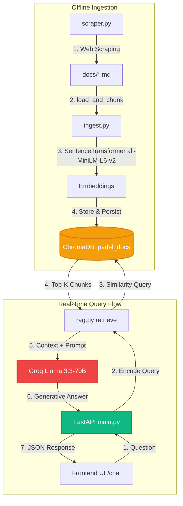

# 🎾 The Padel Company — AI Support Chatbot

An AI-powered customer support chatbot for [thepadelcompany.in](https://thepadelcompany.in) built with a full Retrieval-Augmented Generation (RAG) pipeline using **FastAPI**, **ChromaDB**, **SentenceTransformers**, and **Groq's LPU** (Llama 3.3).

---

## 📋 Table of Contents
1. [System Architecture](#-system-architecture)
2. [Key Features](#-key-features)
3. [Project Directory Structure](#-project-directory-structure)
4. [Local Installation & Setup](#-local-installation--setup)
5. [How to Run Locally](#-how-to-run-locally)
6. [API Specification](#-api-specification)
7. [Parameter Tuning & Configuration](#-parameter-tuning--configuration)
8. [Adding/Scraping New Knowledge](#-addingscraping-new-knowledge)
9. [Cloud Deployment (Render & Vercel/Netlify)](#-cloud-deployment-render--vercelnetlify)
10. [Troubleshooting & FAQs](#-troubleshooting--faqs)

---

## 🎨 System Architecture

The project splits into an offline ingestion phase and a real-time query phase:



---

## ✨ Key Features

* **Lazy-Loading Architecture**: Starts in `<200ms` globally. Embedding model and database connections are loaded dynamically on the first query. Highly optimized for memory-constrained cloud environments (such as Render's 512MB free tier) to prevent Out-Of-Memory (OOM) crashes.
* **Minimalist Brand Match UI**: Responsive HTML/CSS/JS frontend featuring clickable suggested questions, emojis, scrolling state persistence, and styling aligned with the light theme of `thepadelcompany.in`.
* **Zero-Hallucination Guardrails**: Prompts are constrained to answer strictly from the retrieved database context, falling back politely to a contact message if the context does not contain the answer.
* **Local Embedding Processing**: Generates embeddings locally using `all-MiniLM-L6-v2` (384-dimensional vectors) on CPU without external API dependency.

---

## 🏗️ Project Directory Structure

```text
AI-powered-customer-support/
├── docs/               # Scraped pages + custom context (pricing, listings, bookings, partnerships)
├── chroma_db/          # Persistent local vector store (auto-created during ingestion)
├── frontend/           # Chat Web Interface
│   ├── index.html      # Responsive chat viewport with clickable suggestions
│   ├── style.css       # Minimalist light-mode stylesheet matching the official brand look
│   └── app.js          # API connection, bubble renderer, and typing indicators
├── main.py             # FastAPI backend server
├── rag.py              # Core RAG search and completions pipeline (lazy-loaded)
├── ingest.py           # Chunking and embedding generation pipeline
├── scraper.py          # Playwright-based website scraper script
├── requirements.txt    # Python dependencies
└── .gitignore          # Git exclusion rules for secrets, DBs, and venvs
```

---

## 🚀 Local Installation & Setup

### Prerequisites
* Python 3.9, 3.10, 3.11, or 3.12 (Python 3.10+ recommended)
* A Groq API Key (Free tier at [console.groq.com](https://console.groq.com))

### Step-by-Step Installation
1. **Clone or navigate** to the project directory:
   ```bash
   cd AI-powered-customer-support
   ```

2. **Create and activate a virtual environment**:
   ```bash
   # On Windows (PowerShell/CMD)
   python -m venv venv
   venv\Scripts\activate

   # On macOS/Linux
   python3 -m venv venv
   source venv/bin/activate
   ```

3. **Install the dependencies**:
   ```bash
   pip install -r requirements.txt
   ```

4. **Install Playwright Browsers** (only needed if running the scraper):
   ```bash
   playwright install chromium
   ```

5. **Configure Environment Variables**:
   Create a `.env` file in the root directory:
   ```env
   GROQ_API_KEY=gsk_your_actual_key_here
   ```

---

## 💻 How to Run Locally

### 1. Build/Rebuild the Vector Index
Parse the markdown documents in `docs/` and ingest them into the vector database:
```bash
python ingest.py
```
*Note: This creates the `chroma_db/` folder locally.*

### 2. Start the Backend API
Run the Uvicorn ASGI server:
```bash
uvicorn main:app --port 8000
```
* The API will be active at `http://127.0.0.1:8000`
* You can test and inspect the endpoints interactively at `http://127.0.0.1:8000/docs`

### 3. Run the Chat UI
Serve the frontend files locally using Python's static file server in a separate terminal:
```bash
python -m http.server 3000 --directory frontend
```
Open your browser and navigate to **`http://localhost:3000`**.

---

## 📡 API Specification

### `POST /chat`
Sends a user query to the RAG pipeline.

* **Request URL**: `http://localhost:8000/chat`
* **Content-Type**: `application/json`
* **Payload**:
  ```json
  {
    "question": "What are your court booking prices?"
  }
  ```
* **Response (Success - 200 OK)**:
  ```json
  {
    "answer": "Court booking prices are set by individual venue operators and typically range from ₹800 to ₹2,500 per hour across India, depending on the city, facility quality, and time of play."
  }
  ```

### `GET /health`
A simple check to ensure the backend is running.

* **Request URL**: `http://localhost:8000/health`
* **Response (Success - 200 OK)**:
  ```json
  {
    "status": "ok"
  }
  ```

---

## ⚙️ Parameter Tuning & Configuration

You can customize the chunking strategies and retrieval thresholds:

### Ingest Parameters (`ingest.py`)
Modify the `RecursiveCharacterTextSplitter` args to adjust chunk granularity:
```python
splitter = RecursiveCharacterTextSplitter(
    chunk_size=500,     # Size of each text chunk (in characters)
    chunk_overlap=50,   # Overlap between adjacent chunks to maintain context
    separators=["\n\n", "\n", " "]
)
```

### RAG Parameters (`rag.py`)
* **Retrieve Count (`top_k`)**: Inside `retrieve(query, top_k=4)`, adjust `top_k` to pass more or fewer context snippets to the LLM.
* **Inference Settings**: Adjust the completions parameters inside `generate()`:
  ```python
  response = get_groq_client().chat.completions.create(
      model="llama-3.3-70b-versatile",
      temperature=0.1,    # Low temperature (0.1) reduces hallucinations
      max_tokens=512      # Adjust output answer length
  )
  ```

---

## 📚 Adding/Scraping New Knowledge

To add new information for the chatbot to answer:

### Option A: Add a Custom Doc (Recommended)
1. Create a new markdown file (e.g., `docs/faq.md`).
2. Add your questions and answers in natural text.
3. Re-run `python ingest.py` to index the new files.

### Option B: Scrape a New Page
1. Open `scraper.py` and append your target website URL to the `URLS` list.
2. Run the scraper:
   ```bash
   python scraper.py
   ```
3. Re-run `python ingest.py` to update the vector index.

---

## ☁️ Cloud Deployment (Render & Vercel/Netlify)

### 1. Backend Deployment (Render)
1. Push your repository to GitHub.
2. Create a new **Web Service** on [Render](https://render.com).
3. Connect your GitHub repository and specify:
   * **Runtime**: `Python`
   * **Build Command**: `pip install -r requirements.txt && python ingest.py` *(This automatically generates your database index at build time so you don't need persistent cloud storage).*
   * **Start Command**: `uvicorn main:app --host 0.0.0.0 --port $PORT`
4. Under **Environment Variables**, add:
   * Key: `GROQ_API_KEY` | Value: `your_actual_groq_api_key`
5. Click **Deploy**. Render will provide a public URL (e.g., `https://your-backend.onrender.com`).

### 2. Frontend Deployment (Vercel/Netlify)
1. Open `frontend/app.js` and change `API_URL` to point to your live Render backend URL:
   ```javascript
   const API_URL = 'https://your-backend.onrender.com/chat';
   ```
2. Commit and push this change to your repository.
3. Deploy to **Vercel** or **Netlify** by selecting the repository and setting the **Root Directory** to `frontend`.

---

## 🛠️ Troubleshooting & FAQs

#### Q1. Why is the chatbot not responding to clicks or queries locally?
* Check if your FastAPI server is actually running on port `8000`.
* Ensure you opened the frontend via `http://localhost:3000` rather than by double-clicking the `index.html` file on disk. Chrome/Edge security policies block API calls (`fetch` calls) made from `file://` origins to local server ports.

#### Q2. Render build fails or times out with "No open ports detected"
* Make sure you are using the lazy-loading setup in `rag.py`. Loading PyTorch and the SentenceTransformer globally blocks Uvicorn from starting up quickly, causing Render's port scans to time out.
* Double-check your Render environment variables. If `GROQ_API_KEY` is missing or invalid, Python will throw an unhandled `ValueError` on boot and crash silently.

#### Q3. How do I clear the local database cache?
* Delete the `chroma_db` directory:
  ```bash
  # Windows
  rmdir /s /q chroma_db
  # macOS/Linux
  rm -rf chroma_db
  ```
* Re-run `python ingest.py` to regenerate the database.
